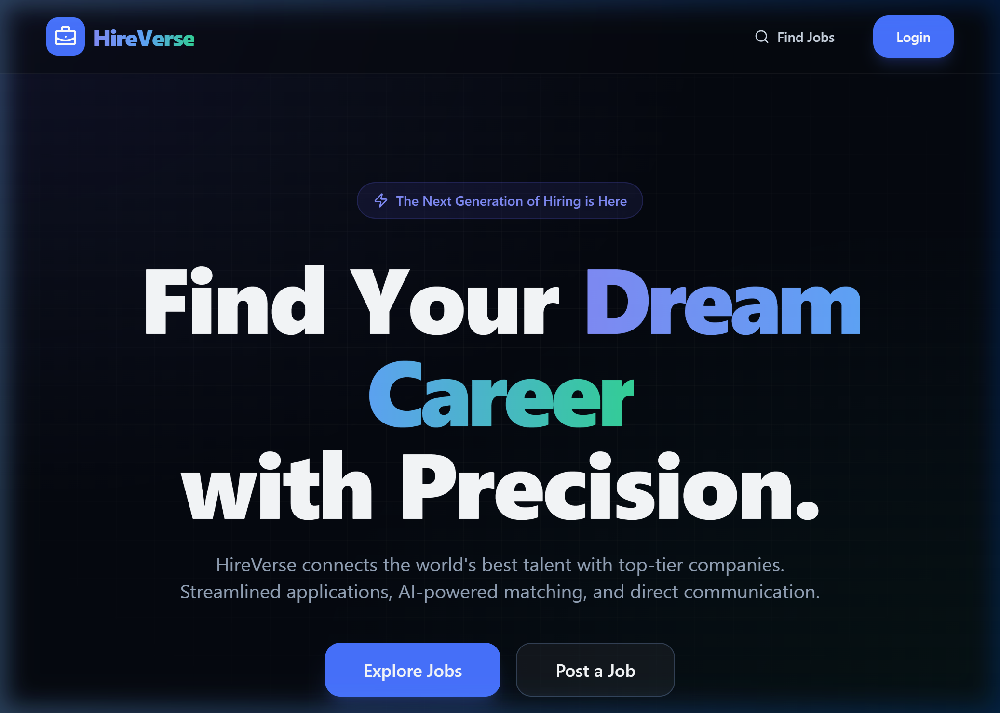

# 🚀 HireVerse - Modern Job Portal

**HireVerse** is a premium, full-stack job portal built with React, Supabase, and Clerk. It features a sleek, dark-themed UI with glassmorphism, smooth animations, and role-based access control for both recruiters and candidates.

## 🖼️ Screenshots

### Landing Page


### Professional Job Listings


### Premium UI Design


## ✨ Features

- **💼 Recruiter Dashboard**: Post jobs, manage applications, and toggle hiring status.
- **🔍 Advanced Job Search**: Filter by location, company, and title.
- **🛡️ Secure Auth**: Integrated with Clerk for seamless authentication and onboarding.
- **❤️ Job Wishlist**: Candidates can save jobs for later.
- **📄 Application Tracking**: Apply with resumes and track your status.
- **🎨 Premium UI**: Dark mode, gradients, glassmorphism, and responsive design.

## 🛠️ Tech Stack

- **Frontend**: React (Vite), Tailwind CSS, Shadcn UI, Framer Motion
- **Backend**: Supabase (Postgres)
- **Authentication**: Clerk
- **Forms**: React Hook Form + Zod
- **Documentation**: React Markdown Editor

## 🚀 Getting Started

### 1. Prerequisites
- Node.js (v18+)
- Supabase Account
- Clerk Account

### 2. Installation
```bash
# Clone the repository
git clone https://github.com/Arun-sahukar/HireVerse2.git

# Navigate to the folder
cd HireVerse2

# Install dependencies
npm install
```

### 3. Environment Setup
Create a `.env` file in the root and add your keys:
```env
VITE_CLERK_PUBLISHABLE_KEY=your_clerk_key
VITE_SUPABASE_URL=your_supabase_url
VITE_SUPABASE_ANON_KEY=your_supabase_anon_key
```

### 4. Database Setup
Run the SQL provided in `supabase-schema.sql` in your Supabase SQL Editor to create the necessary tables (`jobs`, `companies`, `applications`, `saved_jobs`).

### 5. Start the App
```bash
npm run dev
```

## 📬 Contact
Follow me on GitHub: [@Arun-sahukar](https://github.com/Arun-sahukar)
